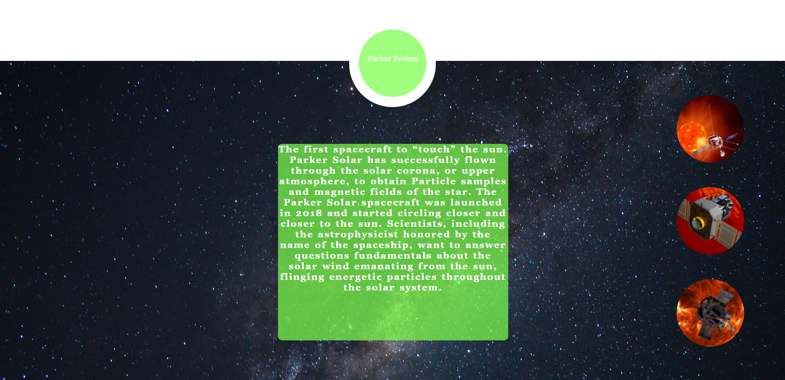

# Nasa_Space_Apps (Team Aratu)

This is a dedicated repository for the hackatob Nasa Space Apps soluction project.

## Table of Contents

- [General Info](#general-info)
- [Technologies](#technologies)
- [Screenshots](#screenshots)
- [Setup](#setup)
- [Status](#status)
- [References](#references)
- [Team](#team)

## General Info

This is a project where our team created a site (for Desktop) using HTML and CSS to solve the challange "On the wat to the sun".

## Technologies

Project was created with:

- HTML/CSS;

## Screenshots

### 

### 

### 

### 

### 

### 

### 

## Setup

If you what to use it on your Pc just clone or download the project or acess this link () to see the details. 

## Status

Project is: Done and presented in the hachaton!

## References

- Our Project used this references to develop our soluction.

https://www.nasa.gov/feature/goddard/2021/five-weird-things-that-happen-in-outer-space/
https://blogs.nasa.gov/parkersolarprobe/2021/11/10/space-dust-presents-opportunities-challenges-as-parker-solar-probe-speeds-back-toward-the-sun/
https://www.nasa.gov/feature/goddard/2018/traveling-to-the-sun-why-won-t-parker-solar-probe-melt
https://www.youtube.com/watch?app=desktop&v=XBudjihQKsw&feature=youtu.be
https://www.youtube.com/watch?app=desktop&v=LkaLfbuB_6E&feature=youtu.be
https://www.nasa.gov/feature/goddard/2021/nasa-enters-the-solar-atmosphere-for-the-first-time-bringing-new-discoveries
https://www.nasa.gov/aurora
https://solarsystem.nasa.gov/eclipses/home/
https://blogs.nasa.gov/sunspot/2021/12/10/solar-tour-pit-stop-8-venus/
https://blogs.nasa.gov/sunspot/2021/12/11/solar-tour-pit-stop-9-the-solar-wind/
https://blogs.nasa.gov/sunspot/2021/12/14/solar-tour-pit-stop-12-at-the-sun/
https://spaceplace.nasa.gov/menu/sun/
https://solarsystem.nasa.gov/solar-system/sun/overview/
https://www.nasa.gov/feature/goddard/2020/how-scientists-around-world-track-solar-cycle-sunspots-sun
https://www.nasa.gov/feature/goddard/2021/five-questions-about-space-weather-and-its-effects-on-earth-answered

## Team

| Names             | Contact                         |
| ----------------  | ------------------------------- |
| Ana Luiza Motta   | mottaluizamarques@gmail.com     |
| Débora Araí       | deborarejala.arai@gmail.com     |
| Lorena Seabra     | gabrielparisio@hotmail.com      |
| Marcela Azoubel   | marcela.azoubel@gmail.com       |
| Rafael Alves      | rjhxalves@gmail.com             |